# NFT Marketplace

NFT Marketplace is a decentralized platform for creating, trading, and managing NFTs (Non-Fungible Tokens). This project was developed as part of a course at SUPSI (University of Applied Sciences and Arts of Southern Switzerland). The platform provides a comprehensive solution for NFT creators and collectors, offering a secure and user-friendly environment for minting, trading, and managing digital assets.

## Key Features

### Part A - Core Features

#### NFT Minting
- **Metadata Support**: Attach rich metadata to your NFTs including name, description, and attributes
- **Image Integration**: Upload and associate images with your NFTs
- **Collection Creation**: Create and manage collections of related NFTs
- **Creator Rights**: Maintain creator information and rights for each NFT

#### NFT Listing
- **Fixed Price Listings**: List NFTs for sale at fixed prices
- **Listing Fee Management**: Transparent fee structure for listing NFTs
- **Listing Status**: Track listing status (active, sold, canceled)

#### Direct Purchase
- **Secure Payments**: Ethereum-based secure payment processing
- **Transaction History**: Track all purchase transactions
- **Gas Optimization**: Efficient transaction handling

#### Collection Viewing
- **Gallery View**: Browse NFTs in a visually appealing gallery
- **Detailed View**: View comprehensive NFT details and metadata
- **Collection Organization**: Organize NFTs by collections

### Part B - Bonus Features

#### Advanced Search
- **Multi-criteria Filtering**: Filter by price, collection, creator, etc.
- **Keyword Search**: Search across NFT metadata
- **Sorting Options**: Sort by price, date, popularity

### Feature Checklist

- [x] Mint NFTs with metadata and images
- [x] List NFTs for sale
- [x] Direct purchase functionality
- [x] Collection and NFT viewing interface
- [x] Advanced search and filtering

## Project Architecture

The project follows a fully decentralized architecture, with smart contracts handling all core functionality and a frontend interface for user interaction:

### Smart Contracts Layer
- **NFT.sol**: 
  - ERC721-compliant NFT implementation
  - Metadata storage and management
  - Collection management
  - Token ownership tracking

- **MarketplaceRegistry.sol**:
  - Listing management
  - Sale processing
  - Fee handling
  - Transaction history

- **NFTFactory.sol**:
  - Collection creation
  - Contract deployment
  - Collection tracking

### Frontend Layer
- **React-based Interface**:
  - Modern, responsive design
  - Web3Auth integration for wallet management
  - Real-time updates
  - User-friendly navigation

### Design Patterns Used

- **Factory Pattern**: 
  - Creates new NFT collections
  - Manages collection deployment
  - Tracks deployed contracts

- **Registry Pattern**:
  - Manages NFT listings
  - Handles sales
  - Tracks ownership

- **Ownable Pattern**:
  - Access control
  - Ownership management
  - Permission handling

- **ReentrancyGuard**:
  - Prevents reentrancy attacks
  - Secure transaction handling
  - State protection

## Technical Requirements

- **Node.js**: Version 18 or higher
  - Required for development
  - Package management
  - Script execution

- **Hardhat**: 
  - Smart contract development
  - Testing framework
  - Deployment tools

- **Web3Auth**:
  - Wallet integration
  - Authentication
  - Transaction signing

- **Operating System**:
  - Windows 10/11
  - macOS 10.15+
  - Linux (Ubuntu 20.04+)

## Usage Guide

### Setup and Installation

1. **Environment Setup**:
   ```bash
   # Install dependencies
   npm install
   
   # Install Hardhat
   npm install --save-dev hardhat
   ```

2. **Contract Deployment**:
   ```bash
   # Deploy to local network
   npx hardhat run scripts/deploy.js --network localhost
   ```

3. **Frontend Development**:
   ```bash
   # Install frontend dependencies
   cd frontend
   npm install
   
   # Start development server
   npm run dev
   ```

### User Workflow

1. **Wallet Connection**:
   - Connect using Web3Auth
   - Switch to correct network
   - Verify connection

2. **Collection Creation**:
   - Access NFT Factory
   - Define collection parameters
   - Deploy collection contract

3. **NFT Minting**:
   - Select collection
   - Upload metadata
   - Upload image
   - Confirm minting

4. **Listing NFTs**:
   - Select NFT to list
   - Set price
   - Pay listing fee
   - Confirm listing

5. **Purchasing NFTs**:
   - Browse available NFTs
   - View details
   - Make purchase
   - Confirm transaction

## Development Workflow

## Environment Configuration

Before starting the project, you need to set up two separate environment files:

1. **Blockchain Environment Setup**:
   ```bash
   # Navigate to blockchain directory
   cd blockchain
   
   # Create blockchain environment file
   cp .env.example .env.local
   ```

   Configure the following variables in `blockchain/.env.local`:
   ```
   # Network Configuration
   MARKETPLACE_REGISTRY_CONTRACT_ADDRESS_SAPPHIRE_DEVNET=0x5FbDB2315678afecb367f032d93F642f64180aa3
   
   # Contract Addresses (will be automatically populated after deployment)
   NFT_FACTORY_ADDRESS=
   MARKETPLACE_REGISTRY_ADDRESS=
   ```

2. **Frontend Environment Setup**:
   ```bash
   # Navigate to frontend directory
   cd frontend
   
   # Create frontend environment file
   cp .env.example .env.local
   ```

   Configure the following variables in `frontend/.env.local`:
   ```
   AUTH0_BASE_URL='http://localhost:3000'
   AUTH0_CLIENT_ID='BNwg1Y10LZP38dUap6n4CSway1c93fiF9w7iFtsK325Q5k5i3xCEsIOh5zbtKbycuppHpNKf2bQc5IHCTsbCaG4'
   AUTH0_CLIENT_SECRET='8c4b63008a4d43bace05ff77ab5fc3f259e708d30f0d8a5b422be9ebc0ab325d'

   NEXT_PUBLIC_GOOGLE_CLIENT_ID=492971295798-bt2g35sqo8u7u4oke8kt6gmnhnea4i98.apps.googleusercontent.com
   NEXT_PUBLIC_WEB3AUTH_CLIENT_ID=BA8tAVWMkH9_5GAA4qCx1xkfp9zwFlDp84KHrAcHSlC3sG_OZTJqwr1A9DUE4OjBPRrAJrctWROEgY-SK7Q3u4c

   AUTH_SECRET="x4JNDmC7JPJbGVr8Dz28rmfBjq9V6OhwSWmBFdq5pwA="
   UTH_GOOGLE_ID="226674831154-hqkjnihvomk96aamcqat7fsnl7thglcd.apps.googleusercontent.com"
   AUTH_GOOGLE_SECRET="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"

   PINATA_JWT=eyJhbGciOiJIUzI1NiIsInR5cCI6IkpXVCJ9.eyJ1c2VySW5mb3JtYXRpb24iOnsiaWQiOiJhZTcyNzMxYy03YTQ2LTQ4Y2UtODk4Mi1jYjMwYjQ4MTE5YjgiLCJlbWFpbCI6ImJsb2NrY2hhaW4uZGFtbkBnbWFpbC5jb20iLCJlbWFpbF92ZXJpZmllZCI6dHJ1ZSwicGluX3BvbGljeSI6eyJyZWdpb25zIjpbeyJkZXNpcmVkUmVwbGljYXRpb25Db3VudCI6MSwiaWQiOiJGUkExIn0seyJkZXNpcmVkUmVwbGljYXRpb25Db3VudCI6MSwiaWQiOiJOWUMxIn1dLCJ2ZXJzaW9uIjoxfSwibWZhX2VuYWJsZWQiOmZhbHNlLCJzdGF0dXMiOiJBQ1RJVkUifSwiYXV0aGVudGljYXRpb25UeXBlIjoic2NvcGVkS2V5Iiwic2NvcGVkS2V5S2V5IjoiYTUxMmI5NDBhMDllZDNlNmJjNGUiLCJzY29wZWRLZXlTZWNyZXQiOiI3NjQ2YTE0OGZhOTJiYjQ2MjRmNzU3ZDRjYmEyMzAxYzJmNjg2OTA4MGIzZGQ4NWFkNTVlMWQ0YzQxZDMyYzgyIiwiZXhwIjoxNzc1OTE0Nzg0fQ.w3JY-Kt46yRTLg5mkr_9sjtrKp5V_6XAsVnOT6Gbc5c
   NEXT_PUBLIC_GATEWAY_URL=coral-calm-cephalopod-969.mypinata.cloud
   NEXT_PUBLIC_BASE_URL=http://localhost:3000
   NEXT_PUBLIC_NFT_FACTORY_ADDRESS=0xe7f1725E7734CE288F8367e1Bb143E90bb3F0512
   NEXT_PUBLIC_MARKETPLACE_ADDRESS=0x5FbDB2315678afecb367f032d93F642f64180aa3
   ```

3. **After Contract Deployment**:
   - Deploy contracts with `npx hardhat run scripts/deploy.js --network localhost`
   - Copy the contract addresses from `blockchain/.env` to `frontend/.env`
   - This ensures the frontend can interact with the deployed contracts

4. **For Production Deployment**:
   - Update the network configuration in both `.env` files
   - Set the appropriate RPC URLs
   - Update contract addresses after deployment


### Local Development

1. **Start Local Blockchain**:
   ```bash
   npx hardhat node
   ```

2. **Deploy Contracts**:
   ```bash
   npx hardhat run scripts/deploy.js --network localhost
   ```

3. **Run Tests**:
   ```bash
   npx hardhat test
   ```

### Testing

- **Unit Tests**: Test individual contract functions
- **Integration Tests**: Test contract interactions
- **Frontend Tests**: Test UI components

## Security Considerations

- **Smart Contract Security**:
  - Reentrancy protection
  - Access control
  - Input validation
  - State management

- **Frontend Security**:
  - Web3Auth integration
  - Transaction verification
  - Data validation
  - Error handling

## Documentation Materials

### Application Screenshots
The following screenshots showcase the various pages and features of our NFT Marketplace:

1. **Landing and Authentication**
   - Landing Page (`docs/landing-page.png`)
   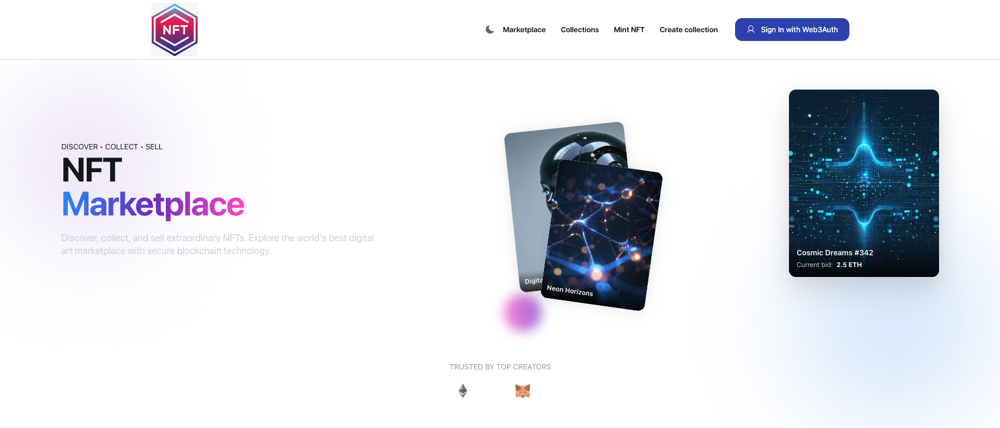
   - Login Page (`docs/login-page.png`)
   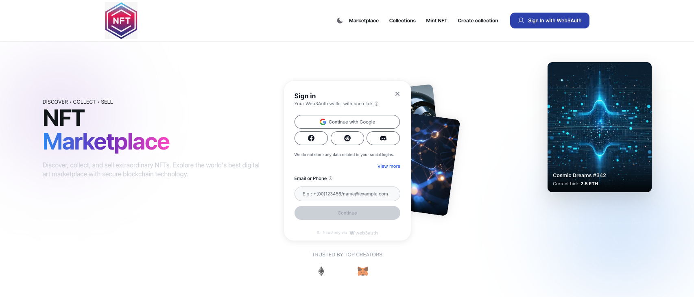

2. **Collection Management**
   - Create Collection Page (`docs/create-collection-page.png`)
   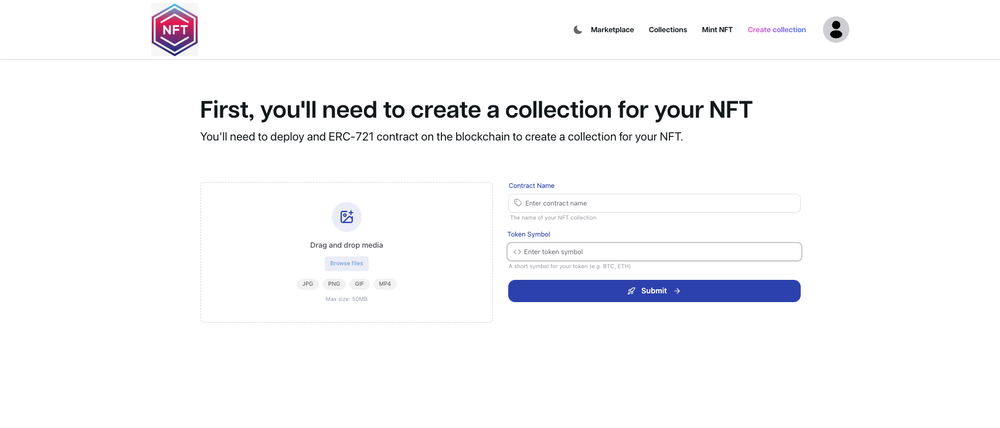
   - Create Collection Form Example (`docs/create-collection-populated-page.png`)
   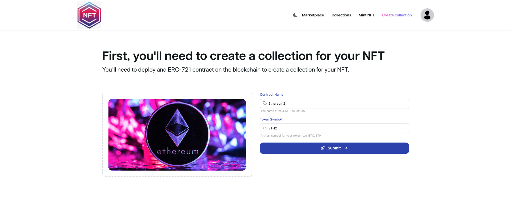
   - Collections Overview Page (`docs/collections-page.png`)
   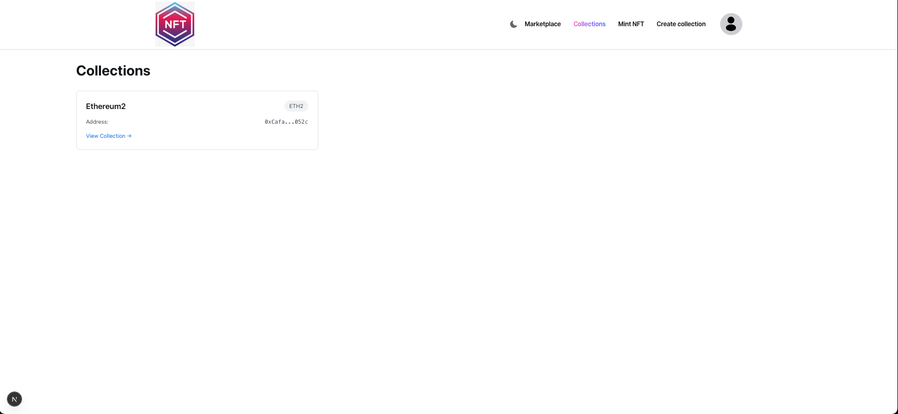
   - Single Collection View (`docs/single-collection-page.png`)
   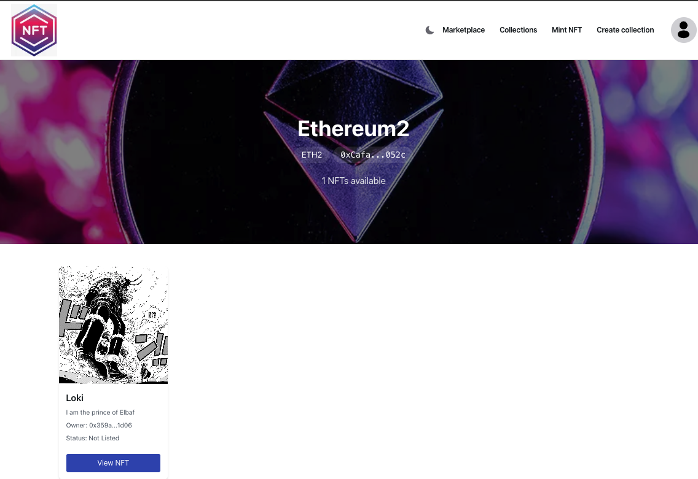

3. **NFT Creation and Management**
   - Mint NFT Page (`docs/mint-nft-page.png`)
   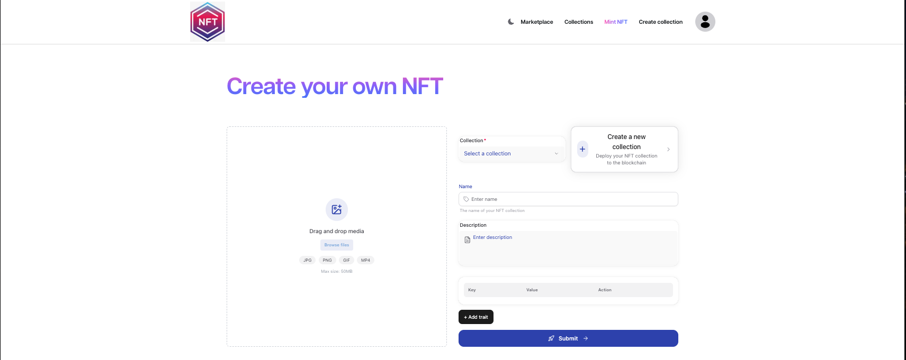
   - Mint NFT Form Example (`docs/mint-nft-populated-page.png`)
   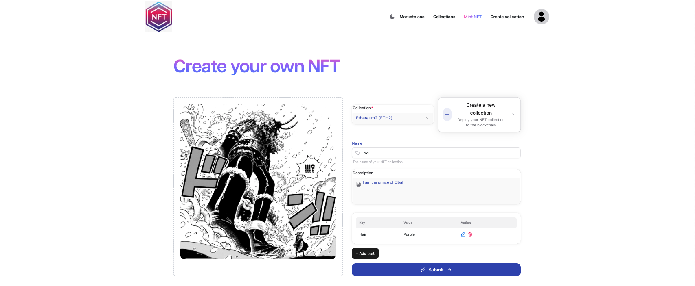
   - NFT Details Page (`docs/nft-details-page.png`)
   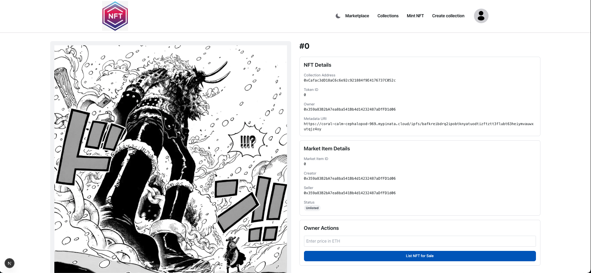


4. **User Interface**
   - Marketplace Page (`docs/marketplace-page.png`)
   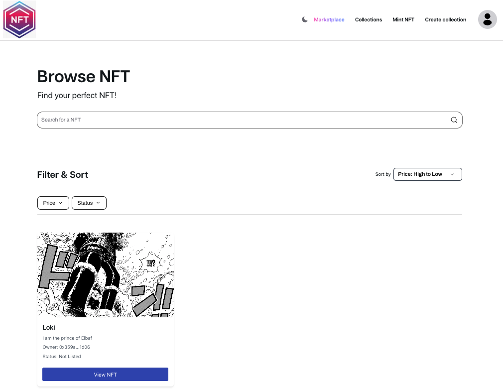
   - User Details Page (`docs/user-details-page.png`)
   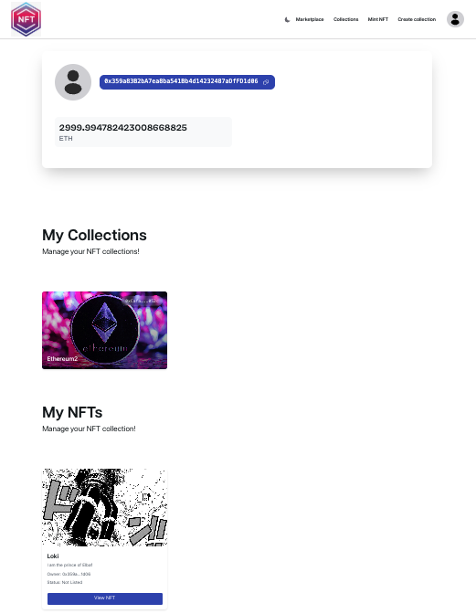


### Demonstration Video
A demonstration video (`docs/list-unlist-buy-nft-video.mov`) is available showing the complete process of:
- Listing an NFT on the marketplace
- Unlisting an NFT from the marketplace
- Purchasing an NFT

This video provides a practical demonstration of the core marketplace functionality and user interaction flow.
[](./docs/list-unlist-buy-nft-video.mov)
*Click the image above to access the demonstration video*

## Authors

- 👤 **Dominik Panzarella**
[](https://www.instagram.com/__dom_/) [](https://www.linkedin.com/in/dominik-panzarella-a8412817a) [](https://stackoverflow.com/users/21978407/dominik-panzarella) [](https://www.youtube.com/channel/UC128UoG-qfNOf6TCjarx5Mw) 
- 👤 **Samuele La Fleur**
[](https://www.instagram.com/samuele.lafleur/) [](https://www.linkedin.com/in/samuele-la-fleur-52a469227/) 

## Contact

For more information, you can contact the developers via email.

---

> This project is intended for educational purposes only and not for commercial use. 
